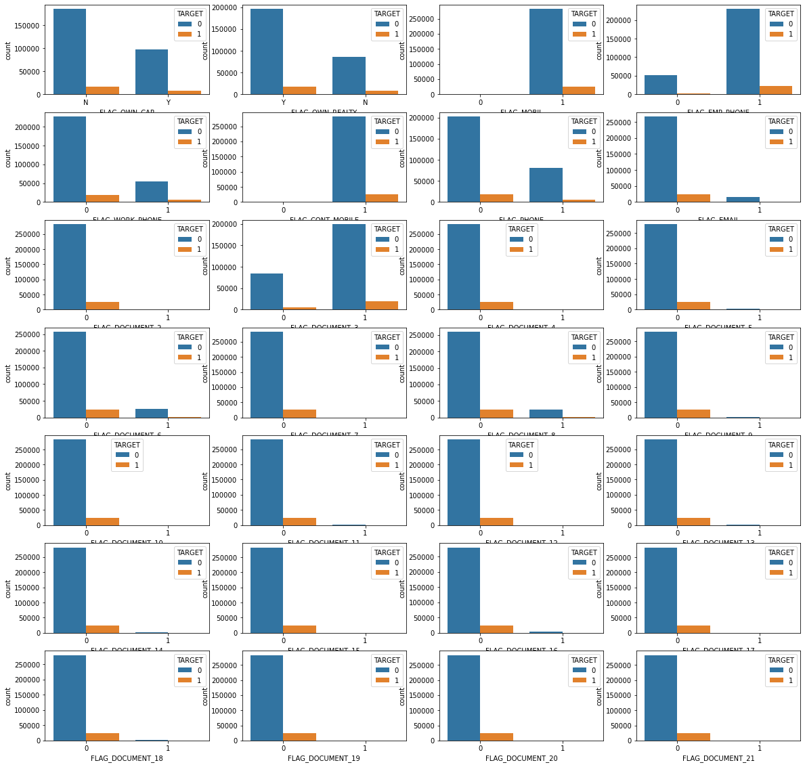
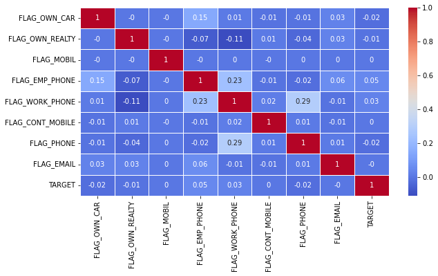
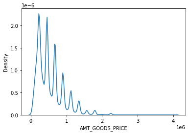
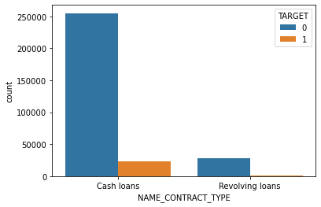
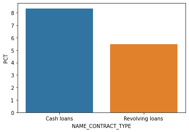
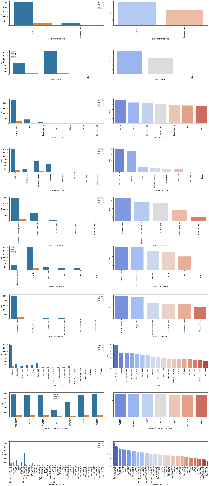

# Loan Default Analysis


```python
#import libraries
import pandas as pd
import numpy as np
import matplotlib.pyplot as plt
import seaborn as sns
```


```python
#Data import and Data Exploration
app = pd.read_csv("application_data.csv")
prev_app =pd.read_csv("previous_application.csv")
```


```python
app.head()
```


<div>
<style scoped>
    .dataframe tbody tr th:only-of-type {
        vertical-align: middle;
    }

    .dataframe tbody tr th {
        vertical-align: top;
    }

    .dataframe thead th {
        text-align: right;
    }
</style>
<table border="1" class="dataframe">
  <thead>
    <tr style="text-align: right;">
      <th></th>
      <th>SK_ID_CURR</th>
      <th>TARGET</th>
      <th>NAME_CONTRACT_TYPE</th>
      <th>CODE_GENDER</th>
      <th>FLAG_OWN_CAR</th>
      <th>FLAG_OWN_REALTY</th>
      <th>CNT_CHILDREN</th>
      <th>AMT_INCOME_TOTAL</th>
      <th>AMT_CREDIT</th>
      <th>AMT_ANNUITY</th>
      <th>...</th>
      <th>FLAG_DOCUMENT_18</th>
      <th>FLAG_DOCUMENT_19</th>
      <th>FLAG_DOCUMENT_20</th>
      <th>FLAG_DOCUMENT_21</th>
      <th>AMT_REQ_CREDIT_BUREAU_HOUR</th>
      <th>AMT_REQ_CREDIT_BUREAU_DAY</th>
      <th>AMT_REQ_CREDIT_BUREAU_WEEK</th>
      <th>AMT_REQ_CREDIT_BUREAU_MON</th>
      <th>AMT_REQ_CREDIT_BUREAU_QRT</th>
      <th>AMT_REQ_CREDIT_BUREAU_YEAR</th>
    </tr>
  </thead>
  <tbody>
    <tr>
      <th>0</th>
      <td>100002</td>
      <td>1</td>
      <td>Cash loans</td>
      <td>M</td>
      <td>N</td>
      <td>Y</td>
      <td>0</td>
      <td>202500.0</td>
      <td>406597.5</td>
      <td>24700.5</td>
      <td>...</td>
      <td>0</td>
      <td>0</td>
      <td>0</td>
      <td>0</td>
      <td>0.0</td>
      <td>0.0</td>
      <td>0.0</td>
      <td>0.0</td>
      <td>0.0</td>
      <td>1.0</td>
    </tr>
    <tr>
      <th>1</th>
      <td>100003</td>
      <td>0</td>
      <td>Cash loans</td>
      <td>F</td>
      <td>N</td>
      <td>N</td>
      <td>0</td>
      <td>270000.0</td>
      <td>1293502.5</td>
      <td>35698.5</td>
      <td>...</td>
      <td>0</td>
      <td>0</td>
      <td>0</td>
      <td>0</td>
      <td>0.0</td>
      <td>0.0</td>
      <td>0.0</td>
      <td>0.0</td>
      <td>0.0</td>
      <td>0.0</td>
    </tr>
    <tr>
      <th>2</th>
      <td>100004</td>
      <td>0</td>
      <td>Revolving loans</td>
      <td>M</td>
      <td>Y</td>
      <td>Y</td>
      <td>0</td>
      <td>67500.0</td>
      <td>135000.0</td>
      <td>6750.0</td>
      <td>...</td>
      <td>0</td>
      <td>0</td>
      <td>0</td>
      <td>0</td>
      <td>0.0</td>
      <td>0.0</td>
      <td>0.0</td>
      <td>0.0</td>
      <td>0.0</td>
      <td>0.0</td>
    </tr>
    <tr>
      <th>3</th>
      <td>100006</td>
      <td>0</td>
      <td>Cash loans</td>
      <td>F</td>
      <td>N</td>
      <td>Y</td>
      <td>0</td>
      <td>135000.0</td>
      <td>312682.5</td>
      <td>29686.5</td>
      <td>...</td>
      <td>0</td>
      <td>0</td>
      <td>0</td>
      <td>0</td>
      <td>NaN</td>
      <td>NaN</td>
      <td>NaN</td>
      <td>NaN</td>
      <td>NaN</td>
      <td>NaN</td>
    </tr>
    <tr>
      <th>4</th>
      <td>100007</td>
      <td>0</td>
      <td>Cash loans</td>
      <td>M</td>
      <td>N</td>
      <td>Y</td>
      <td>0</td>
      <td>121500.0</td>
      <td>513000.0</td>
      <td>21865.5</td>
      <td>...</td>
      <td>0</td>
      <td>0</td>
      <td>0</td>
      <td>0</td>
      <td>0.0</td>
      <td>0.0</td>
      <td>0.0</td>
      <td>0.0</td>
      <td>0.0</td>
      <td>0.0</td>
    </tr>
  </tbody>
</table>
<p>5 rows × 122 columns</p>
</div>


```python
prev_app.head()
```


<div>
<style scoped>
    .dataframe tbody tr th:only-of-type {
        vertical-align: middle;
    }

    .dataframe tbody tr th {
        vertical-align: top;
    }

    .dataframe thead th {
        text-align: right;
    }
</style>
<table border="1" class="dataframe">
  <thead>
    <tr style="text-align: right;">
      <th></th>
      <th>SK_ID_PREV</th>
      <th>SK_ID_CURR</th>
      <th>NAME_CONTRACT_TYPE</th>
      <th>AMT_ANNUITY</th>
      <th>AMT_APPLICATION</th>
      <th>AMT_CREDIT</th>
      <th>AMT_DOWN_PAYMENT</th>
      <th>AMT_GOODS_PRICE</th>
      <th>WEEKDAY_APPR_PROCESS_START</th>
      <th>HOUR_APPR_PROCESS_START</th>
      <th>...</th>
      <th>NAME_SELLER_INDUSTRY</th>
      <th>CNT_PAYMENT</th>
      <th>NAME_YIELD_GROUP</th>
      <th>PRODUCT_COMBINATION</th>
      <th>DAYS_FIRST_DRAWING</th>
      <th>DAYS_FIRST_DUE</th>
      <th>DAYS_LAST_DUE_1ST_VERSION</th>
      <th>DAYS_LAST_DUE</th>
      <th>DAYS_TERMINATION</th>
      <th>NFLAG_INSURED_ON_APPROVAL</th>
    </tr>
  </thead>
  <tbody>
    <tr>
      <th>0</th>
      <td>2030495</td>
      <td>271877</td>
      <td>Consumer loans</td>
      <td>1730.430</td>
      <td>17145.0</td>
      <td>17145.0</td>
      <td>0.0</td>
      <td>17145.0</td>
      <td>SATURDAY</td>
      <td>15</td>
      <td>...</td>
      <td>Connectivity</td>
      <td>12.0</td>
      <td>middle</td>
      <td>POS mobile with interest</td>
      <td>365243.0</td>
      <td>-42.0</td>
      <td>300.0</td>
      <td>-42.0</td>
      <td>-37.0</td>
      <td>0.0</td>
    </tr>
    <tr>
      <th>1</th>
      <td>2802425</td>
      <td>108129</td>
      <td>Cash loans</td>
      <td>25188.615</td>
      <td>607500.0</td>
      <td>679671.0</td>
      <td>NaN</td>
      <td>607500.0</td>
      <td>THURSDAY</td>
      <td>11</td>
      <td>...</td>
      <td>XNA</td>
      <td>36.0</td>
      <td>low_action</td>
      <td>Cash X-Sell: low</td>
      <td>365243.0</td>
      <td>-134.0</td>
      <td>916.0</td>
      <td>365243.0</td>
      <td>365243.0</td>
      <td>1.0</td>
    </tr>
    <tr>
      <th>2</th>
      <td>2523466</td>
      <td>122040</td>
      <td>Cash loans</td>
      <td>15060.735</td>
      <td>112500.0</td>
      <td>136444.5</td>
      <td>NaN</td>
      <td>112500.0</td>
      <td>TUESDAY</td>
      <td>11</td>
      <td>...</td>
      <td>XNA</td>
      <td>12.0</td>
      <td>high</td>
      <td>Cash X-Sell: high</td>
      <td>365243.0</td>
      <td>-271.0</td>
      <td>59.0</td>
      <td>365243.0</td>
      <td>365243.0</td>
      <td>1.0</td>
    </tr>
    <tr>
      <th>3</th>
      <td>2819243</td>
      <td>176158</td>
      <td>Cash loans</td>
      <td>47041.335</td>
      <td>450000.0</td>
      <td>470790.0</td>
      <td>NaN</td>
      <td>450000.0</td>
      <td>MONDAY</td>
      <td>7</td>
      <td>...</td>
      <td>XNA</td>
      <td>12.0</td>
      <td>middle</td>
      <td>Cash X-Sell: middle</td>
      <td>365243.0</td>
      <td>-482.0</td>
      <td>-152.0</td>
      <td>-182.0</td>
      <td>-177.0</td>
      <td>1.0</td>
    </tr>
    <tr>
      <th>4</th>
      <td>1784265</td>
      <td>202054</td>
      <td>Cash loans</td>
      <td>31924.395</td>
      <td>337500.0</td>
      <td>404055.0</td>
      <td>NaN</td>
      <td>337500.0</td>
      <td>THURSDAY</td>
      <td>9</td>
      <td>...</td>
      <td>XNA</td>
      <td>24.0</td>
      <td>high</td>
      <td>Cash Street: high</td>
      <td>NaN</td>
      <td>NaN</td>
      <td>NaN</td>
      <td>NaN</td>
      <td>NaN</td>
      <td>NaN</td>
    </tr>
  </tbody>
</table>
<p>5 rows × 37 columns</p>
</div>


```python
app.shape

```


    (307511, 122)


```python
#Dataframe of missing values columns
missing_values= pd.DataFrame(app.isnull().sum().sort_values()).reset_index()
missing_values.rename(columns={"index":"col_name",0:"null_count"},inplace="True")
missing_values.head()
```


<div>
<style scoped>
    .dataframe tbody tr th:only-of-type {
        vertical-align: middle;
    }

    .dataframe tbody tr th {
        vertical-align: top;
    }

    .dataframe thead th {
        text-align: right;
    }
</style>
<table border="1" class="dataframe">
  <thead>
    <tr style="text-align: right;">
      <th></th>
      <th>col_name</th>
      <th>null_count</th>
    </tr>
  </thead>
  <tbody>
    <tr>
      <th>0</th>
      <td>SK_ID_CURR</td>
      <td>0</td>
    </tr>
    <tr>
      <th>1</th>
      <td>HOUR_APPR_PROCESS_START</td>
      <td>0</td>
    </tr>
    <tr>
      <th>2</th>
      <td>REG_REGION_NOT_WORK_REGION</td>
      <td>0</td>
    </tr>
    <tr>
      <th>3</th>
      <td>LIVE_REGION_NOT_WORK_REGION</td>
      <td>0</td>
    </tr>
    <tr>
      <th>4</th>
      <td>REG_CITY_NOT_LIVE_CITY</td>
      <td>0</td>
    </tr>
  </tbody>
</table>
</div>


```python
#Converting missing values in percentage
missing_values["missing_pct"]= missing_values["null_count"]/app.shape[0]*100
missing_values
```


<div>
<style scoped>
    .dataframe tbody tr th:only-of-type {
        vertical-align: middle;
    }

    .dataframe tbody tr th {
        vertical-align: top;
    }

    .dataframe thead th {
        text-align: right;
    }
</style>
<table border="1" class="dataframe">
  <thead>
    <tr style="text-align: right;">
      <th></th>
      <th>col_name</th>
      <th>null_count</th>
      <th>missing_pct</th>
    </tr>
  </thead>
  <tbody>
    <tr>
      <th>0</th>
      <td>SK_ID_CURR</td>
      <td>0</td>
      <td>0.000000</td>
    </tr>
    <tr>
      <th>1</th>
      <td>HOUR_APPR_PROCESS_START</td>
      <td>0</td>
      <td>0.000000</td>
    </tr>
    <tr>
      <th>2</th>
      <td>REG_REGION_NOT_WORK_REGION</td>
      <td>0</td>
      <td>0.000000</td>
    </tr>
    <tr>
      <th>3</th>
      <td>LIVE_REGION_NOT_WORK_REGION</td>
      <td>0</td>
      <td>0.000000</td>
    </tr>
    <tr>
      <th>4</th>
      <td>REG_CITY_NOT_LIVE_CITY</td>
      <td>0</td>
      <td>0.000000</td>
    </tr>
    <tr>
      <th>...</th>
      <td>...</td>
      <td>...</td>
      <td>...</td>
    </tr>
    <tr>
      <th>117</th>
      <td>NONLIVINGAPARTMENTS_MEDI</td>
      <td>213514</td>
      <td>69.432963</td>
    </tr>
    <tr>
      <th>118</th>
      <td>NONLIVINGAPARTMENTS_MODE</td>
      <td>213514</td>
      <td>69.432963</td>
    </tr>
    <tr>
      <th>119</th>
      <td>COMMONAREA_MODE</td>
      <td>214865</td>
      <td>69.872297</td>
    </tr>
    <tr>
      <th>120</th>
      <td>COMMONAREA_AVG</td>
      <td>214865</td>
      <td>69.872297</td>
    </tr>
    <tr>
      <th>121</th>
      <td>COMMONAREA_MEDI</td>
      <td>214865</td>
      <td>69.872297</td>
    </tr>
  </tbody>
</table>
<p>122 rows × 3 columns</p>
</div>


```python
#Drop missing columns
app.missing_columns= missing_values[missing_values["missing_pct"]>=40]["col_name"].to_list()
app.missing_columns
```

    /var/folders/y0/hsj3fhgj4l5fyf2wpjy4qx_c0000gn/T/ipykernel_45236/3931913704.py:2: UserWarning: Pandas doesn't allow columns to be created via a new attribute name - see https://pandas.pydata.org/pandas-docs/stable/indexing.html#attribute-access
      app.missing_columns= missing_values[missing_values["missing_pct"]>=40]["col_name"].to_list()


    ['EMERGENCYSTATE_MODE',
     'TOTALAREA_MODE',
     'YEARS_BEGINEXPLUATATION_MODE',
     'YEARS_BEGINEXPLUATATION_AVG',
     'YEARS_BEGINEXPLUATATION_MEDI',
     'FLOORSMAX_AVG',
     'FLOORSMAX_MEDI',
     'FLOORSMAX_MODE',
     'HOUSETYPE_MODE',
     'LIVINGAREA_AVG',
     'LIVINGAREA_MODE',
     'LIVINGAREA_MEDI',
     'ENTRANCES_AVG',
     'ENTRANCES_MODE',
     'ENTRANCES_MEDI',
     'APARTMENTS_MEDI',
     'APARTMENTS_AVG',
     'APARTMENTS_MODE',
     'WALLSMATERIAL_MODE',
     'ELEVATORS_MEDI',
     'ELEVATORS_AVG',
     'ELEVATORS_MODE',
     'NONLIVINGAREA_MODE',
     'NONLIVINGAREA_AVG',
     'NONLIVINGAREA_MEDI',
     'EXT_SOURCE_1',
     'BASEMENTAREA_MODE',
     'BASEMENTAREA_AVG',
     'BASEMENTAREA_MEDI',
     'LANDAREA_MEDI',
     'LANDAREA_AVG',
     'LANDAREA_MODE',
     'OWN_CAR_AGE',
     'YEARS_BUILD_MODE',
     'YEARS_BUILD_AVG',
     'YEARS_BUILD_MEDI',
     'FLOORSMIN_AVG',
     'FLOORSMIN_MODE',
     'FLOORSMIN_MEDI',
     'LIVINGAPARTMENTS_AVG',
     'LIVINGAPARTMENTS_MODE',
     'LIVINGAPARTMENTS_MEDI',
     'FONDKAPREMONT_MODE',
     'NONLIVINGAPARTMENTS_AVG',
     'NONLIVINGAPARTMENTS_MEDI',
     'NONLIVINGAPARTMENTS_MODE',
     'COMMONAREA_MODE',
     'COMMONAREA_AVG',
     'COMMONAREA_MEDI']


```python
app_msng_rem= app.drop(labels=app.missing_columns,axis=1)
app_msng_rem
```


<div>
<style scoped>
    .dataframe tbody tr th:only-of-type {
        vertical-align: middle;
    }

    .dataframe tbody tr th {
        vertical-align: top;
    }

    .dataframe thead th {
        text-align: right;
    }
</style>
<table border="1" class="dataframe">
  <thead>
    <tr style="text-align: right;">
      <th></th>
      <th>SK_ID_CURR</th>
      <th>TARGET</th>
      <th>NAME_CONTRACT_TYPE</th>
      <th>CODE_GENDER</th>
      <th>FLAG_OWN_CAR</th>
      <th>FLAG_OWN_REALTY</th>
      <th>CNT_CHILDREN</th>
      <th>AMT_INCOME_TOTAL</th>
      <th>AMT_CREDIT</th>
      <th>AMT_ANNUITY</th>
      <th>...</th>
      <th>FLAG_DOCUMENT_18</th>
      <th>FLAG_DOCUMENT_19</th>
      <th>FLAG_DOCUMENT_20</th>
      <th>FLAG_DOCUMENT_21</th>
      <th>AMT_REQ_CREDIT_BUREAU_HOUR</th>
      <th>AMT_REQ_CREDIT_BUREAU_DAY</th>
      <th>AMT_REQ_CREDIT_BUREAU_WEEK</th>
      <th>AMT_REQ_CREDIT_BUREAU_MON</th>
      <th>AMT_REQ_CREDIT_BUREAU_QRT</th>
      <th>AMT_REQ_CREDIT_BUREAU_YEAR</th>
    </tr>
  </thead>
  <tbody>
    <tr>
      <th>0</th>
      <td>100002</td>
      <td>1</td>
      <td>Cash loans</td>
      <td>M</td>
      <td>N</td>
      <td>Y</td>
      <td>0</td>
      <td>202500.0</td>
      <td>406597.5</td>
      <td>24700.5</td>
      <td>...</td>
      <td>0</td>
      <td>0</td>
      <td>0</td>
      <td>0</td>
      <td>0.0</td>
      <td>0.0</td>
      <td>0.0</td>
      <td>0.0</td>
      <td>0.0</td>
      <td>1.0</td>
    </tr>
    <tr>
      <th>1</th>
      <td>100003</td>
      <td>0</td>
      <td>Cash loans</td>
      <td>F</td>
      <td>N</td>
      <td>N</td>
      <td>0</td>
      <td>270000.0</td>
      <td>1293502.5</td>
      <td>35698.5</td>
      <td>...</td>
      <td>0</td>
      <td>0</td>
      <td>0</td>
      <td>0</td>
      <td>0.0</td>
      <td>0.0</td>
      <td>0.0</td>
      <td>0.0</td>
      <td>0.0</td>
      <td>0.0</td>
    </tr>
    <tr>
      <th>2</th>
      <td>100004</td>
      <td>0</td>
      <td>Revolving loans</td>
      <td>M</td>
      <td>Y</td>
      <td>Y</td>
      <td>0</td>
      <td>67500.0</td>
      <td>135000.0</td>
      <td>6750.0</td>
      <td>...</td>
      <td>0</td>
      <td>0</td>
      <td>0</td>
      <td>0</td>
      <td>0.0</td>
      <td>0.0</td>
      <td>0.0</td>
      <td>0.0</td>
      <td>0.0</td>
      <td>0.0</td>
    </tr>
    <tr>
      <th>3</th>
      <td>100006</td>
      <td>0</td>
      <td>Cash loans</td>
      <td>F</td>
      <td>N</td>
      <td>Y</td>
      <td>0</td>
      <td>135000.0</td>
      <td>312682.5</td>
      <td>29686.5</td>
      <td>...</td>
      <td>0</td>
      <td>0</td>
      <td>0</td>
      <td>0</td>
      <td>NaN</td>
      <td>NaN</td>
      <td>NaN</td>
      <td>NaN</td>
      <td>NaN</td>
      <td>NaN</td>
    </tr>
    <tr>
      <th>4</th>
      <td>100007</td>
      <td>0</td>
      <td>Cash loans</td>
      <td>M</td>
      <td>N</td>
      <td>Y</td>
      <td>0</td>
      <td>121500.0</td>
      <td>513000.0</td>
      <td>21865.5</td>
      <td>...</td>
      <td>0</td>
      <td>0</td>
      <td>0</td>
      <td>0</td>
      <td>0.0</td>
      <td>0.0</td>
      <td>0.0</td>
      <td>0.0</td>
      <td>0.0</td>
      <td>0.0</td>
    </tr>
    <tr>
      <th>...</th>
      <td>...</td>
      <td>...</td>
      <td>...</td>
      <td>...</td>
      <td>...</td>
      <td>...</td>
      <td>...</td>
      <td>...</td>
      <td>...</td>
      <td>...</td>
      <td>...</td>
      <td>...</td>
      <td>...</td>
      <td>...</td>
      <td>...</td>
      <td>...</td>
      <td>...</td>
      <td>...</td>
      <td>...</td>
      <td>...</td>
      <td>...</td>
    </tr>
    <tr>
      <th>307506</th>
      <td>456251</td>
      <td>0</td>
      <td>Cash loans</td>
      <td>M</td>
      <td>N</td>
      <td>N</td>
      <td>0</td>
      <td>157500.0</td>
      <td>254700.0</td>
      <td>27558.0</td>
      <td>...</td>
      <td>0</td>
      <td>0</td>
      <td>0</td>
      <td>0</td>
      <td>NaN</td>
      <td>NaN</td>
      <td>NaN</td>
      <td>NaN</td>
      <td>NaN</td>
      <td>NaN</td>
    </tr>
    <tr>
      <th>307507</th>
      <td>456252</td>
      <td>0</td>
      <td>Cash loans</td>
      <td>F</td>
      <td>N</td>
      <td>Y</td>
      <td>0</td>
      <td>72000.0</td>
      <td>269550.0</td>
      <td>12001.5</td>
      <td>...</td>
      <td>0</td>
      <td>0</td>
      <td>0</td>
      <td>0</td>
      <td>NaN</td>
      <td>NaN</td>
      <td>NaN</td>
      <td>NaN</td>
      <td>NaN</td>
      <td>NaN</td>
    </tr>
    <tr>
      <th>307508</th>
      <td>456253</td>
      <td>0</td>
      <td>Cash loans</td>
      <td>F</td>
      <td>N</td>
      <td>Y</td>
      <td>0</td>
      <td>153000.0</td>
      <td>677664.0</td>
      <td>29979.0</td>
      <td>...</td>
      <td>0</td>
      <td>0</td>
      <td>0</td>
      <td>0</td>
      <td>1.0</td>
      <td>0.0</td>
      <td>0.0</td>
      <td>1.0</td>
      <td>0.0</td>
      <td>1.0</td>
    </tr>
    <tr>
      <th>307509</th>
      <td>456254</td>
      <td>1</td>
      <td>Cash loans</td>
      <td>F</td>
      <td>N</td>
      <td>Y</td>
      <td>0</td>
      <td>171000.0</td>
      <td>370107.0</td>
      <td>20205.0</td>
      <td>...</td>
      <td>0</td>
      <td>0</td>
      <td>0</td>
      <td>0</td>
      <td>0.0</td>
      <td>0.0</td>
      <td>0.0</td>
      <td>0.0</td>
      <td>0.0</td>
      <td>0.0</td>
    </tr>
    <tr>
      <th>307510</th>
      <td>456255</td>
      <td>0</td>
      <td>Cash loans</td>
      <td>F</td>
      <td>N</td>
      <td>N</td>
      <td>0</td>
      <td>157500.0</td>
      <td>675000.0</td>
      <td>49117.5</td>
      <td>...</td>
      <td>0</td>
      <td>0</td>
      <td>0</td>
      <td>0</td>
      <td>0.0</td>
      <td>0.0</td>
      <td>0.0</td>
      <td>2.0</td>
      <td>0.0</td>
      <td>1.0</td>
    </tr>
  </tbody>
</table>
<p>307511 rows × 73 columns</p>
</div>


```python
#Exploring Flag Columns
flag_col=[]
for col in app_msng_rem.columns:
    if col.startswith("FLAG_"):
        flag_col.append(col)
        
flag_col        
```


    ['FLAG_OWN_CAR',
     'FLAG_OWN_REALTY',
     'FLAG_MOBIL',
     'FLAG_EMP_PHONE',
     'FLAG_WORK_PHONE',
     'FLAG_CONT_MOBILE',
     'FLAG_PHONE',
     'FLAG_EMAIL',
     'FLAG_DOCUMENT_2',
     'FLAG_DOCUMENT_3',
     'FLAG_DOCUMENT_4',
     'FLAG_DOCUMENT_5',
     'FLAG_DOCUMENT_6',
     'FLAG_DOCUMENT_7',
     'FLAG_DOCUMENT_8',
     'FLAG_DOCUMENT_9',
     'FLAG_DOCUMENT_10',
     'FLAG_DOCUMENT_11',
     'FLAG_DOCUMENT_12',
     'FLAG_DOCUMENT_13',
     'FLAG_DOCUMENT_14',
     'FLAG_DOCUMENT_15',
     'FLAG_DOCUMENT_16',
     'FLAG_DOCUMENT_17',
     'FLAG_DOCUMENT_18',
     'FLAG_DOCUMENT_19',
     'FLAG_DOCUMENT_20',
     'FLAG_DOCUMENT_21']


```python
#Checking relation between Flag and target columns
flag_tgt_col = app_msng_rem[flag_col+["TARGET"]]
flag_tgt_col.head()
```


<div>
<style scoped>
    .dataframe tbody tr th:only-of-type {
        vertical-align: middle;
    }

    .dataframe tbody tr th {
        vertical-align: top;
    }

    .dataframe thead th {
        text-align: right;
    }
</style>
<table border="1" class="dataframe">
  <thead>
    <tr style="text-align: right;">
      <th></th>
      <th>FLAG_OWN_CAR</th>
      <th>FLAG_OWN_REALTY</th>
      <th>FLAG_MOBIL</th>
      <th>FLAG_EMP_PHONE</th>
      <th>FLAG_WORK_PHONE</th>
      <th>FLAG_CONT_MOBILE</th>
      <th>FLAG_PHONE</th>
      <th>FLAG_EMAIL</th>
      <th>FLAG_DOCUMENT_2</th>
      <th>FLAG_DOCUMENT_3</th>
      <th>...</th>
      <th>FLAG_DOCUMENT_13</th>
      <th>FLAG_DOCUMENT_14</th>
      <th>FLAG_DOCUMENT_15</th>
      <th>FLAG_DOCUMENT_16</th>
      <th>FLAG_DOCUMENT_17</th>
      <th>FLAG_DOCUMENT_18</th>
      <th>FLAG_DOCUMENT_19</th>
      <th>FLAG_DOCUMENT_20</th>
      <th>FLAG_DOCUMENT_21</th>
      <th>TARGET</th>
    </tr>
  </thead>
  <tbody>
    <tr>
      <th>0</th>
      <td>N</td>
      <td>Y</td>
      <td>1</td>
      <td>1</td>
      <td>0</td>
      <td>1</td>
      <td>1</td>
      <td>0</td>
      <td>0</td>
      <td>1</td>
      <td>...</td>
      <td>0</td>
      <td>0</td>
      <td>0</td>
      <td>0</td>
      <td>0</td>
      <td>0</td>
      <td>0</td>
      <td>0</td>
      <td>0</td>
      <td>1</td>
    </tr>
    <tr>
      <th>1</th>
      <td>N</td>
      <td>N</td>
      <td>1</td>
      <td>1</td>
      <td>0</td>
      <td>1</td>
      <td>1</td>
      <td>0</td>
      <td>0</td>
      <td>1</td>
      <td>...</td>
      <td>0</td>
      <td>0</td>
      <td>0</td>
      <td>0</td>
      <td>0</td>
      <td>0</td>
      <td>0</td>
      <td>0</td>
      <td>0</td>
      <td>0</td>
    </tr>
    <tr>
      <th>2</th>
      <td>Y</td>
      <td>Y</td>
      <td>1</td>
      <td>1</td>
      <td>1</td>
      <td>1</td>
      <td>1</td>
      <td>0</td>
      <td>0</td>
      <td>0</td>
      <td>...</td>
      <td>0</td>
      <td>0</td>
      <td>0</td>
      <td>0</td>
      <td>0</td>
      <td>0</td>
      <td>0</td>
      <td>0</td>
      <td>0</td>
      <td>0</td>
    </tr>
    <tr>
      <th>3</th>
      <td>N</td>
      <td>Y</td>
      <td>1</td>
      <td>1</td>
      <td>0</td>
      <td>1</td>
      <td>0</td>
      <td>0</td>
      <td>0</td>
      <td>1</td>
      <td>...</td>
      <td>0</td>
      <td>0</td>
      <td>0</td>
      <td>0</td>
      <td>0</td>
      <td>0</td>
      <td>0</td>
      <td>0</td>
      <td>0</td>
      <td>0</td>
    </tr>
    <tr>
      <th>4</th>
      <td>N</td>
      <td>Y</td>
      <td>1</td>
      <td>1</td>
      <td>0</td>
      <td>1</td>
      <td>0</td>
      <td>0</td>
      <td>0</td>
      <td>0</td>
      <td>...</td>
      <td>0</td>
      <td>0</td>
      <td>0</td>
      <td>0</td>
      <td>0</td>
      <td>0</td>
      <td>0</td>
      <td>0</td>
      <td>0</td>
      <td>0</td>
    </tr>
  </tbody>
</table>
<p>5 rows × 29 columns</p>
</div>


```python
#Plot relationship between flag columns and Target
plt.figure(figsize=(20,20))
for i,col in enumerate(flag_col):
    plt.subplot(7,4,i+1)
    sns.countplot(data=flag_tgt_col, x=col,hue="TARGET")
```


    

    


```python
#Creating correlation matrix
flag_corr= ['FLAG_OWN_CAR','FLAG_OWN_REALTY','FLAG_MOBIL','FLAG_EMP_PHONE','FLAG_WORK_PHONE','FLAG_CONT_MOBILE','FLAG_PHONE','FLAG_EMAIL','TARGET']
flag_corr_df=app_msng_rem[fig_corr] 
```


```python
flag_corr_df['FLAG_OWN_CAR']=flag_corr_df['FLAG_OWN_CAR'].replace({'N':0,'Y':1})
flag_corr_df['FLAG_OWN_REALTY']=flag_corr_df['FLAG_OWN_REALTY'].replace({'N':0,'Y':1})
```

    /var/folders/y0/hsj3fhgj4l5fyf2wpjy4qx_c0000gn/T/ipykernel_45236/1768161448.py:1: SettingWithCopyWarning: 
    A value is trying to be set on a copy of a slice from a DataFrame.
    Try using .loc[row_indexer,col_indexer] = value instead
    
    See the caveats in the documentation: https://pandas.pydata.org/pandas-docs/stable/user_guide/indexing.html#returning-a-view-versus-a-copy
      flag_corr_df['FLAG_OWN_CAR']=flag_corr_df['FLAG_OWN_CAR'].replace({'N':0,'Y':1})
    /var/folders/y0/hsj3fhgj4l5fyf2wpjy4qx_c0000gn/T/ipykernel_45236/1768161448.py:2: SettingWithCopyWarning: 
    A value is trying to be set on a copy of a slice from a DataFrame.
    Try using .loc[row_indexer,col_indexer] = value instead
    
    See the caveats in the documentation: https://pandas.pydata.org/pandas-docs/stable/user_guide/indexing.html#returning-a-view-versus-a-copy
      flag_corr_df['FLAG_OWN_REALTY']=flag_corr_df['FLAG_OWN_REALTY'].replace({'N':0,'Y':1})


```python

corr_df = round(flag_corr_df.corr(),2)
plt.figure(figsize=(10,5))
sns.heatmap(corr_df,cmap='coolwarm',linewidths=.5,annot=True)
```


    <AxesSubplot:>


    

    


```python
#Drop Flag columns as they do not have good correlation with Target
app_flag_rem=app_msng_rem.drop(labels=flag_col,axis=1)
app_flag_rem.shape

```


    (307511, 45)


```python
app_flag_rem.head()
```


<div>
<style scoped>
    .dataframe tbody tr th:only-of-type {
        vertical-align: middle;
    }

    .dataframe tbody tr th {
        vertical-align: top;
    }

    .dataframe thead th {
        text-align: right;
    }
</style>
<table border="1" class="dataframe">
  <thead>
    <tr style="text-align: right;">
      <th></th>
      <th>SK_ID_CURR</th>
      <th>TARGET</th>
      <th>NAME_CONTRACT_TYPE</th>
      <th>CODE_GENDER</th>
      <th>CNT_CHILDREN</th>
      <th>AMT_INCOME_TOTAL</th>
      <th>AMT_CREDIT</th>
      <th>AMT_ANNUITY</th>
      <th>AMT_GOODS_PRICE</th>
      <th>NAME_TYPE_SUITE</th>
      <th>...</th>
      <th>DEF_30_CNT_SOCIAL_CIRCLE</th>
      <th>OBS_60_CNT_SOCIAL_CIRCLE</th>
      <th>DEF_60_CNT_SOCIAL_CIRCLE</th>
      <th>DAYS_LAST_PHONE_CHANGE</th>
      <th>AMT_REQ_CREDIT_BUREAU_HOUR</th>
      <th>AMT_REQ_CREDIT_BUREAU_DAY</th>
      <th>AMT_REQ_CREDIT_BUREAU_WEEK</th>
      <th>AMT_REQ_CREDIT_BUREAU_MON</th>
      <th>AMT_REQ_CREDIT_BUREAU_QRT</th>
      <th>AMT_REQ_CREDIT_BUREAU_YEAR</th>
    </tr>
  </thead>
  <tbody>
    <tr>
      <th>0</th>
      <td>100002</td>
      <td>1</td>
      <td>Cash loans</td>
      <td>M</td>
      <td>0</td>
      <td>202500.0</td>
      <td>406597.5</td>
      <td>24700.5</td>
      <td>351000.0</td>
      <td>Unaccompanied</td>
      <td>...</td>
      <td>2.0</td>
      <td>2.0</td>
      <td>2.0</td>
      <td>-1134.0</td>
      <td>0.0</td>
      <td>0.0</td>
      <td>0.0</td>
      <td>0.0</td>
      <td>0.0</td>
      <td>1.0</td>
    </tr>
    <tr>
      <th>1</th>
      <td>100003</td>
      <td>0</td>
      <td>Cash loans</td>
      <td>F</td>
      <td>0</td>
      <td>270000.0</td>
      <td>1293502.5</td>
      <td>35698.5</td>
      <td>1129500.0</td>
      <td>Family</td>
      <td>...</td>
      <td>0.0</td>
      <td>1.0</td>
      <td>0.0</td>
      <td>-828.0</td>
      <td>0.0</td>
      <td>0.0</td>
      <td>0.0</td>
      <td>0.0</td>
      <td>0.0</td>
      <td>0.0</td>
    </tr>
    <tr>
      <th>2</th>
      <td>100004</td>
      <td>0</td>
      <td>Revolving loans</td>
      <td>M</td>
      <td>0</td>
      <td>67500.0</td>
      <td>135000.0</td>
      <td>6750.0</td>
      <td>135000.0</td>
      <td>Unaccompanied</td>
      <td>...</td>
      <td>0.0</td>
      <td>0.0</td>
      <td>0.0</td>
      <td>-815.0</td>
      <td>0.0</td>
      <td>0.0</td>
      <td>0.0</td>
      <td>0.0</td>
      <td>0.0</td>
      <td>0.0</td>
    </tr>
    <tr>
      <th>3</th>
      <td>100006</td>
      <td>0</td>
      <td>Cash loans</td>
      <td>F</td>
      <td>0</td>
      <td>135000.0</td>
      <td>312682.5</td>
      <td>29686.5</td>
      <td>297000.0</td>
      <td>Unaccompanied</td>
      <td>...</td>
      <td>0.0</td>
      <td>2.0</td>
      <td>0.0</td>
      <td>-617.0</td>
      <td>NaN</td>
      <td>NaN</td>
      <td>NaN</td>
      <td>NaN</td>
      <td>NaN</td>
      <td>NaN</td>
    </tr>
    <tr>
      <th>4</th>
      <td>100007</td>
      <td>0</td>
      <td>Cash loans</td>
      <td>M</td>
      <td>0</td>
      <td>121500.0</td>
      <td>513000.0</td>
      <td>21865.5</td>
      <td>513000.0</td>
      <td>Unaccompanied</td>
      <td>...</td>
      <td>0.0</td>
      <td>0.0</td>
      <td>0.0</td>
      <td>-1106.0</td>
      <td>0.0</td>
      <td>0.0</td>
      <td>0.0</td>
      <td>0.0</td>
      <td>0.0</td>
      <td>0.0</td>
    </tr>
  </tbody>
</table>
<p>5 rows × 45 columns</p>
</div>


```python
#DROP EXT_SOURCE column because of poor correlation with Target
app_score_col_rmvd=app_flag_rem.drop(['EXT_SOURCE_2','EXT_SOURCE_3'],axis=1)
app_score_col_rmvd.shape
```


    (307511, 43)


### FEATURE ENGINEERING


```python
#Missing value imputation
app_score_col_rmvd.isnull().sum().sort_values()/app_score_col_rmvd.shape[0]
```


    SK_ID_CURR                     0.000000
    ORGANIZATION_TYPE              0.000000
    LIVE_CITY_NOT_WORK_CITY        0.000000
    REG_CITY_NOT_WORK_CITY         0.000000
    REG_CITY_NOT_LIVE_CITY         0.000000
    LIVE_REGION_NOT_WORK_REGION    0.000000
    REG_REGION_NOT_WORK_REGION     0.000000
    REG_REGION_NOT_LIVE_REGION     0.000000
    HOUR_APPR_PROCESS_START        0.000000
    WEEKDAY_APPR_PROCESS_START     0.000000
    REGION_RATING_CLIENT_W_CITY    0.000000
    DAYS_ID_PUBLISH                0.000000
    DAYS_REGISTRATION              0.000000
    DAYS_EMPLOYED                  0.000000
    DAYS_BIRTH                     0.000000
    REGION_RATING_CLIENT           0.000000
    NAME_HOUSING_TYPE              0.000000
    TARGET                         0.000000
    NAME_CONTRACT_TYPE             0.000000
    REGION_POPULATION_RELATIVE     0.000000
    CNT_CHILDREN                   0.000000
    AMT_INCOME_TOTAL               0.000000
    AMT_CREDIT                     0.000000
    CODE_GENDER                    0.000000
    NAME_INCOME_TYPE               0.000000
    NAME_EDUCATION_TYPE            0.000000
    NAME_FAMILY_STATUS             0.000000
    DAYS_LAST_PHONE_CHANGE         0.000003
    CNT_FAM_MEMBERS                0.000007
    AMT_ANNUITY                    0.000039
    AMT_GOODS_PRICE                0.000904
    DEF_60_CNT_SOCIAL_CIRCLE       0.003320
    OBS_60_CNT_SOCIAL_CIRCLE       0.003320
    DEF_30_CNT_SOCIAL_CIRCLE       0.003320
    OBS_30_CNT_SOCIAL_CIRCLE       0.003320
    NAME_TYPE_SUITE                0.004201
    AMT_REQ_CREDIT_BUREAU_QRT      0.135016
    AMT_REQ_CREDIT_BUREAU_HOUR     0.135016
    AMT_REQ_CREDIT_BUREAU_DAY      0.135016
    AMT_REQ_CREDIT_BUREAU_WEEK     0.135016
    AMT_REQ_CREDIT_BUREAU_MON      0.135016
    AMT_REQ_CREDIT_BUREAU_YEAR     0.135016
    OCCUPATION_TYPE                0.313455
    dtype: float64


```python
app_score_col_rmvd.groupby("CNT_FAM_MEMBERS").size()
```


    CNT_FAM_MEMBERS
    1.0      67847
    2.0     158357
    3.0      52601
    4.0      24697
    5.0       3478
    6.0        408
    7.0         81
    8.0         20
    9.0          6
    10.0         3
    11.0         1
    12.0         2
    13.0         1
    14.0         2
    15.0         1
    16.0         2
    20.0         2
    dtype: int64


```python
#Filling missing values

app_score_col_rmvd["CNT_FAM_MEMBERS"]=app_score_col_rmvd["CNT_FAM_MEMBERS"].fillna((app_score_col_rmvd["CNT_FAM_MEMBERS"]).mode()[0])
```


```python
app_score_col_rmvd["CNT_FAM_MEMBERS"].isnull().sum()
```


    0


```python
app_score_col_rmvd.groupby("OCCUPATION_TYPE").size().sort_values()
```


    OCCUPATION_TYPE
    IT staff                   526
    HR staff                   563
    Realty agents              751
    Secretaries               1305
    Waiters/barmen staff      1348
    Low-skill Laborers        2093
    Private service staff     2652
    Cleaning staff            4653
    Cooking staff             5946
    Security staff            6721
    Medicine staff            8537
    Accountants               9813
    High skill tech staff    11380
    Drivers                  18603
    Managers                 21371
    Core staff               27570
    Sales staff              32102
    Laborers                 55186
    dtype: int64


```python
app_score_col_rmvd["OCCUPATION_TYPE"].mode()[0]
```


    'Laborers'


```python
#Filling missing values
app_score_col_rmvd["OCCUPATION_TYPE"]=app_score_col_rmvd["OCCUPATION_TYPE"].fillna((app_score_col_rmvd["OCCUPATION_TYPE"]).mode()[0])
```


```python
app_score_col_rmvd["OCCUPATION_TYPE"].isnull().sum()
```


    0


```python
app_score_col_rmvd.groupby(["NAME_TYPE_SUITE"]).size()
```


    NAME_TYPE_SUITE
    Children             3267
    Family              40149
    Group of people       271
    Other_A               866
    Other_B              1770
    Spouse, partner     11370
    Unaccompanied      248526
    dtype: int64


```python
#Filling missing values
app_score_col_rmvd["NAME_TYPE_SUITE"]=app_score_col_rmvd["NAME_TYPE_SUITE"].fillna((app_score_col_rmvd["NAME_TYPE_SUITE"]).mode()[0])
```


```python
app_score_col_rmvd["NAME_TYPE_SUITE"].isnull().sum()
```


    0


```python
#Filling missing values
app_score_col_rmvd["AMT_ANNUITY"]=app_score_col_rmvd["AMT_ANNUITY"].fillna((app_score_col_rmvd["AMT_ANNUITY"]).mode()[0])
```


```python
app_score_col_rmvd["AMT_ANNUITY"].isnull().sum()
```


    0


```python
#Making List of AMT_REQ_CREDIT_BUREAU

amt_req_col= []
for col in app_score_col_rmvd.columns:
    if col. startswith("AMT_REQ_CREDIT_BUREAU"):
        amt_req_col.append(col)
        
amt_req_col        
```


    ['AMT_REQ_CREDIT_BUREAU_HOUR',
     'AMT_REQ_CREDIT_BUREAU_DAY',
     'AMT_REQ_CREDIT_BUREAU_WEEK',
     'AMT_REQ_CREDIT_BUREAU_MON',
     'AMT_REQ_CREDIT_BUREAU_QRT',
     'AMT_REQ_CREDIT_BUREAU_YEAR']


```python
for col in amt_req_col:
    app_score_col_rmvd[col]= app_score_col_rmvd[col].fillna((app_score_col_rmvd[col]).median())
```


```python
 app_score_col_rmvd[col].isnull().sum()
```


    0


```python
 app_score_col_rmvd["AMT_GOODS_PRICE"].isnull().sum()
    
```


    278


```python
app_score_col_rmvd["AMT_GOODS_PRICE"].agg(["min","max","median","mean"])
```


    min       4.050000e+04
    max       4.050000e+06
    median    4.500000e+05
    mean      5.383962e+05
    Name: AMT_GOODS_PRICE, dtype: float64


```python
 app_score_col_rmvd["AMT_GOODS_PRICE"]= app_score_col_rmvd["AMT_GOODS_PRICE"].fillna((app_score_col_rmvd["AMT_GOODS_PRICE"]).median())
```


```python
app_score_col_rmvd["AMT_GOODS_PRICE"].isnull().sum()
```


    0


```python
app_score_col_rmvd["AMT_CREDIT"].isnull().sum()
```


    0


# Value Modification


```python
#Making list of Days column
days_col=[]
for col in app_score_col_rmvd.columns:
    if col.startswith("DAYS"):
        days_col.append(col)
days_col        
        
```


    ['DAYS_BIRTH',
     'DAYS_EMPLOYED',
     'DAYS_REGISTRATION',
     'DAYS_ID_PUBLISH',
     'DAYS_LAST_PHONE_CHANGE']


```python
#Converting negative values to positive
for col in days_col:
    app_score_col_rmvd[col]=abs(app_score_col_rmvd[col])
    
app_score_col_rmvd.head()    
```


<div>
<style scoped>
    .dataframe tbody tr th:only-of-type {
        vertical-align: middle;
    }

    .dataframe tbody tr th {
        vertical-align: top;
    }

    .dataframe thead th {
        text-align: right;
    }
</style>
<table border="1" class="dataframe">
  <thead>
    <tr style="text-align: right;">
      <th></th>
      <th>SK_ID_CURR</th>
      <th>TARGET</th>
      <th>NAME_CONTRACT_TYPE</th>
      <th>CODE_GENDER</th>
      <th>CNT_CHILDREN</th>
      <th>AMT_INCOME_TOTAL</th>
      <th>AMT_CREDIT</th>
      <th>AMT_ANNUITY</th>
      <th>AMT_GOODS_PRICE</th>
      <th>NAME_TYPE_SUITE</th>
      <th>...</th>
      <th>DEF_30_CNT_SOCIAL_CIRCLE</th>
      <th>OBS_60_CNT_SOCIAL_CIRCLE</th>
      <th>DEF_60_CNT_SOCIAL_CIRCLE</th>
      <th>DAYS_LAST_PHONE_CHANGE</th>
      <th>AMT_REQ_CREDIT_BUREAU_HOUR</th>
      <th>AMT_REQ_CREDIT_BUREAU_DAY</th>
      <th>AMT_REQ_CREDIT_BUREAU_WEEK</th>
      <th>AMT_REQ_CREDIT_BUREAU_MON</th>
      <th>AMT_REQ_CREDIT_BUREAU_QRT</th>
      <th>AMT_REQ_CREDIT_BUREAU_YEAR</th>
    </tr>
  </thead>
  <tbody>
    <tr>
      <th>0</th>
      <td>100002</td>
      <td>1</td>
      <td>Cash loans</td>
      <td>M</td>
      <td>0</td>
      <td>202500.0</td>
      <td>406597.5</td>
      <td>24700.5</td>
      <td>351000.0</td>
      <td>Unaccompanied</td>
      <td>...</td>
      <td>2.0</td>
      <td>2.0</td>
      <td>2.0</td>
      <td>1134.0</td>
      <td>0.0</td>
      <td>0.0</td>
      <td>0.0</td>
      <td>0.0</td>
      <td>0.0</td>
      <td>1.0</td>
    </tr>
    <tr>
      <th>1</th>
      <td>100003</td>
      <td>0</td>
      <td>Cash loans</td>
      <td>F</td>
      <td>0</td>
      <td>270000.0</td>
      <td>1293502.5</td>
      <td>35698.5</td>
      <td>1129500.0</td>
      <td>Family</td>
      <td>...</td>
      <td>0.0</td>
      <td>1.0</td>
      <td>0.0</td>
      <td>828.0</td>
      <td>0.0</td>
      <td>0.0</td>
      <td>0.0</td>
      <td>0.0</td>
      <td>0.0</td>
      <td>0.0</td>
    </tr>
    <tr>
      <th>2</th>
      <td>100004</td>
      <td>0</td>
      <td>Revolving loans</td>
      <td>M</td>
      <td>0</td>
      <td>67500.0</td>
      <td>135000.0</td>
      <td>6750.0</td>
      <td>135000.0</td>
      <td>Unaccompanied</td>
      <td>...</td>
      <td>0.0</td>
      <td>0.0</td>
      <td>0.0</td>
      <td>815.0</td>
      <td>0.0</td>
      <td>0.0</td>
      <td>0.0</td>
      <td>0.0</td>
      <td>0.0</td>
      <td>0.0</td>
    </tr>
    <tr>
      <th>3</th>
      <td>100006</td>
      <td>0</td>
      <td>Cash loans</td>
      <td>F</td>
      <td>0</td>
      <td>135000.0</td>
      <td>312682.5</td>
      <td>29686.5</td>
      <td>297000.0</td>
      <td>Unaccompanied</td>
      <td>...</td>
      <td>0.0</td>
      <td>2.0</td>
      <td>0.0</td>
      <td>617.0</td>
      <td>0.0</td>
      <td>0.0</td>
      <td>0.0</td>
      <td>0.0</td>
      <td>0.0</td>
      <td>1.0</td>
    </tr>
    <tr>
      <th>4</th>
      <td>100007</td>
      <td>0</td>
      <td>Cash loans</td>
      <td>M</td>
      <td>0</td>
      <td>121500.0</td>
      <td>513000.0</td>
      <td>21865.5</td>
      <td>513000.0</td>
      <td>Unaccompanied</td>
      <td>...</td>
      <td>0.0</td>
      <td>0.0</td>
      <td>0.0</td>
      <td>1106.0</td>
      <td>0.0</td>
      <td>0.0</td>
      <td>0.0</td>
      <td>0.0</td>
      <td>0.0</td>
      <td>0.0</td>
    </tr>
  </tbody>
</table>
<p>5 rows × 43 columns</p>
</div>


```python
app_score_col_rmvd.info()
```

    <class 'pandas.core.frame.DataFrame'>
    RangeIndex: 307511 entries, 0 to 307510
    Data columns (total 43 columns):
     #   Column                       Non-Null Count   Dtype  
    ---  ------                       --------------   -----  
     0   SK_ID_CURR                   307511 non-null  int64  
     1   TARGET                       307511 non-null  int64  
     2   NAME_CONTRACT_TYPE           307511 non-null  object 
     3   CODE_GENDER                  307511 non-null  object 
     4   CNT_CHILDREN                 307511 non-null  int64  
     5   AMT_INCOME_TOTAL             307511 non-null  float64
     6   AMT_CREDIT                   307511 non-null  float64
     7   AMT_ANNUITY                  307511 non-null  float64
     8   AMT_GOODS_PRICE              307511 non-null  float64
     9   NAME_TYPE_SUITE              307511 non-null  object 
     10  NAME_INCOME_TYPE             307511 non-null  object 
     11  NAME_EDUCATION_TYPE          307511 non-null  object 
     12  NAME_FAMILY_STATUS           307511 non-null  object 
     13  NAME_HOUSING_TYPE            307511 non-null  object 
     14  REGION_POPULATION_RELATIVE   307511 non-null  float64
     15  DAYS_BIRTH                   307511 non-null  int64  
     16  DAYS_EMPLOYED                307511 non-null  int64  
     17  DAYS_REGISTRATION            307511 non-null  float64
     18  DAYS_ID_PUBLISH              307511 non-null  int64  
     19  OCCUPATION_TYPE              307511 non-null  object 
     20  CNT_FAM_MEMBERS              307511 non-null  float64
     21  REGION_RATING_CLIENT         307511 non-null  int64  
     22  REGION_RATING_CLIENT_W_CITY  307511 non-null  int64  
     23  WEEKDAY_APPR_PROCESS_START   307511 non-null  object 
     24  HOUR_APPR_PROCESS_START      307511 non-null  int64  
     25  REG_REGION_NOT_LIVE_REGION   307511 non-null  int64  
     26  REG_REGION_NOT_WORK_REGION   307511 non-null  int64  
     27  LIVE_REGION_NOT_WORK_REGION  307511 non-null  int64  
     28  REG_CITY_NOT_LIVE_CITY       307511 non-null  int64  
     29  REG_CITY_NOT_WORK_CITY       307511 non-null  int64  
     30  LIVE_CITY_NOT_WORK_CITY      307511 non-null  int64  
     31  ORGANIZATION_TYPE            307511 non-null  object 
     32  OBS_30_CNT_SOCIAL_CIRCLE     306490 non-null  float64
     33  DEF_30_CNT_SOCIAL_CIRCLE     306490 non-null  float64
     34  OBS_60_CNT_SOCIAL_CIRCLE     306490 non-null  float64
     35  DEF_60_CNT_SOCIAL_CIRCLE     306490 non-null  float64
     36  DAYS_LAST_PHONE_CHANGE       307510 non-null  float64
     37  AMT_REQ_CREDIT_BUREAU_HOUR   307511 non-null  float64
     38  AMT_REQ_CREDIT_BUREAU_DAY    307511 non-null  float64
     39  AMT_REQ_CREDIT_BUREAU_WEEK   307511 non-null  float64
     40  AMT_REQ_CREDIT_BUREAU_MON    307511 non-null  float64
     41  AMT_REQ_CREDIT_BUREAU_QRT    307511 non-null  float64
     42  AMT_REQ_CREDIT_BUREAU_YEAR   307511 non-null  float64
    dtypes: float64(18), int64(15), object(10)
    memory usage: 100.9+ MB


```python
#Outlier detection and treatment
app_score_col_rmvd["AMT_GOODS_PRICE"].agg(["min","max","median"])
```


    min         40500.0
    max       4050000.0
    median     450000.0
    Name: AMT_GOODS_PRICE, dtype: float64


```python
sns.kdeplot(data=app_score_col_rmvd, x="AMT_GOODS_PRICE")
```


    <AxesSubplot:xlabel='AMT_GOODS_PRICE', ylabel='Density'>


    

    


```python
app_score_col_rmvd["AMT_GOODS_PRICE"].quantile([0.1,0.2,0.3,0.4,0.5,0.6,0.7,0.8,0.9,0.99])
```


    0.10     180000.0
    0.20     225000.0
    0.30     270000.0
    0.40     378000.0
    0.50     450000.0
    0.60     522000.0
    0.70     675000.0
    0.80     814500.0
    0.90    1093500.0
    0.99    1800000.0
    Name: AMT_GOODS_PRICE, dtype: float64


```python
#Binning
bins= [0,100000,200000,300000,400000,500000,600000,700000,800000,900000,4050000]
ranges =["0-100k","100k-200k","200k-300k","300k-400k","400k-500k","500k-600k","600k-700k","700k-800k","800k-900k","Above 900k"]
app_score_col_rmvd["AMT_GOODS_PRICE"]=pd.cut(app_score_col_rmvd["AMT_GOODS_PRICE"],bins,labels=ranges)
```


```python
app_score_col_rmvd.groupby(["AMT_GOODS_PRICE"]).size()
```


    AMT_GOODS_PRICE
    0-100k         8709
    100k-200k     32956
    200k-300k     62761
    300k-400k     21219
    400k-500k     57251
    500k-600k     13117
    600k-700k     40024
    700k-800k      8110
    800k-900k     21484
    Above 900k    41880
    dtype: int64


```python
app_score_col_rmvd["AMT_INCOME_TOTAL"].quantile([0.1,0.2,0.3,0.4,0.5,0.6,0.7,0.8,0.9,0.99])
```


    0.10     81000.0
    0.20     99000.0
    0.30    112500.0
    0.40    135000.0
    0.50    147150.0
    0.60    162000.0
    0.70    180000.0
    0.80    225000.0
    0.90    270000.0
    0.99    472500.0
    Name: AMT_INCOME_TOTAL, dtype: float64


```python
#Binning
bins= [0,100000,150000,200000,250000,300000,350000,400000,472500]
ranges =["0-100k","100k-150k","150k-200k","200k-250k","250k-300k","300k-350k","350k-400k","Above 400k"]
app_score_col_rmvd["AMT_INCOME_TOTAL"]=pd.cut(app_score_col_rmvd["AMT_INCOME_TOTAL"],bins,labels=ranges)
```


```python
app_score_col_rmvd.groupby(["AMT_INCOME_TOTAL"]).size()
```


    AMT_INCOME_TOTAL
    0-100k        63698
    100k-150k     91591
    150k-200k     64307
    200k-250k     48137
    250k-300k     17039
    300k-350k      8874
    350k-400k      5802
    Above 400k     5049
    dtype: int64


```python
app_score_col_rmvd["AMT_CREDIT"].quantile([0.1,0.2,0.3,0.4,0.5,0.6,0.7,0.8,0.9,0.99])
```


    0.10     180000.0
    0.20     254700.0
    0.30     306306.0
    0.40     432000.0
    0.50     513531.0
    0.60     604152.0
    0.70     755190.0
    0.80     900000.0
    0.90    1133748.0
    0.99    1854000.0
    Name: AMT_CREDIT, dtype: float64


```python
bins= [0,200000,400000,600000,800000,900000,1000000,1854000]
ranges =["0-200k","200k-400k","400k-600k","600k-800k","800k-900k","900k-1M","Above 1M"]
app_score_col_rmvd["AMT_CREDIT"]=pd.cut(app_score_col_rmvd["AMT_CREDIT"],bins,labels=ranges)
```


```python
app_score_col_rmvd.groupby(["AMT_CREDIT"]).size()
```


    AMT_CREDIT
    0-200k       36144
    200k-400k    81151
    400k-600k    66270
    600k-800k    43242
    800k-900k    21792
    900k-1M       8927
    Above 1M     46910
    dtype: int64


```python
app_score_col_rmvd["AMT_ANNUITY"].quantile([0.1,0.2,0.3,0.4,0.5,0.6,0.7,0.8,0.9,0.99])
```


    0.10    11074.5
    0.20    14697.0
    0.30    18189.0
    0.40    21865.5
    0.50    24903.0
    0.60    28062.0
    0.70    32004.0
    0.80    37516.5
    0.90    45954.0
    0.99    70006.5
    Name: AMT_ANNUITY, dtype: float64


```python
app_score_col_rmvd["AMT_ANNUITY"].max()
```


    258025.5


```python
bins= [0,25000,50000,100000,150000,200000,258025]
ranges =["0-25K","25K-50K","50k-100K","100k-150K","150K-200K","Above 200K"]
app_score_col_rmvd["AMT_ANNUITY_RANGE"]=pd.cut(app_score_col_rmvd["AMT_ANNUITY"],bins,labels=ranges)
```


```python
app_score_col_rmvd.groupby(["AMT_ANNUITY"]).size()
```


    AMT_ANNUITY
    1615.5       1
    1980.0       2
    1993.5       1
    2052.0       1
    2164.5       2
                ..
    216589.5     1
    220297.5     1
    225000.0    23
    230161.5     1
    258025.5     1
    Length: 13672, dtype: int64


```python
app_score_col_rmvd["DAYS_EMPLOYED"].quantile([0.1,0.2,0.3,0.4,0.5,0.6,0.7,0.8,0.9,0.99])
```


    0.10       392.0
    0.20       749.0
    0.30      1132.0
    0.40      1597.0
    0.50      2219.0
    0.60      3032.0
    0.70      4435.0
    0.80      9188.0
    0.90    365243.0
    0.99    365243.0
    Name: DAYS_EMPLOYED, dtype: float64


```python
app_score_col_rmvd["DAYS_EMPLOYED"].max()
```


    365243


```python
bins= [0,1825,3650,5475,7300,9125,10950,12775,14600,16425,18250,365243]
ranges =["0-5Y","5Y-10Y","10Y-15Y","15Y-20Y","20Y-25Y","25Y-30Y","30Y-35Y","35Y-40Y","40Y-45Y","45Y-50Y","Above 50Y"]
app_score_col_rmvd["DAYS_EMPLOYED_RANGE"]=pd.cut(app_score_col_rmvd["DAYS_EMPLOYED"],bins,labels=ranges)
```


```python
app_score_col_rmvd.groupby(["DAYS_EMPLOYED_RANGE"]).size()
```


    DAYS_EMPLOYED_RANGE
    0-5Y         136309
    5Y-10Y        64872
    10Y-15Y       27549
    15Y-20Y       10849
    20Y-25Y        6243
    25Y-30Y        3308
    30Y-35Y        1939
    35Y-40Y         832
    40Y-45Y         210
    45Y-50Y          24
    Above 50Y     55374
    dtype: int64


```python
app_score_col_rmvd["DAYS_BIRTH"].quantile([0.1,0.2,0.3,0.4,0.5,0.6,0.7,0.8,0.9,0.99])
```


    0.10    10284.0
    0.20    11694.0
    0.30    13140.0
    0.40    14416.0
    0.50    15750.0
    0.60    17220.0
    0.70    18885.0
    0.80    20474.0
    0.90    22181.0
    0.99    24419.0
    Name: DAYS_BIRTH, dtype: float64


```python
bins= [0,7300,10950,14600,18250,21900,25229]
ranges =["20Y","20Y-30Y","30Y-40Y","40Y-50Y","50Y-60Y","Above 60Y"]
app_score_col_rmvd["DAYS_BIRTH_RANGE"]=pd.cut(app_score_col_rmvd["DAYS_BIRTH"],bins,labels=ranges)
```


```python
app_score_col_rmvd.groupby(["DAYS_BIRTH_RANGE"]).size()
```


    DAYS_BIRTH_RANGE
    20Y              0
    20Y-30Y      45021
    30Y-40Y      82308
    40Y-50Y      76541
    50Y-60Y      68062
    Above 60Y    35579
    dtype: int64


```python
#Data Analysis
app_score_col_rmvd.dtypes.value_counts()
```


    int64       15
    float64     15
    object      10
    category     1
    category     1
    category     1
    category     1
    category     1
    category     1
    dtype: int64


```python
#Exploring object type
obj_var = app_score_col_rmvd.select_dtypes(include=["object"]).columns
obj_var
```


    Index(['NAME_CONTRACT_TYPE', 'CODE_GENDER', 'NAME_TYPE_SUITE',
           'NAME_INCOME_TYPE', 'NAME_EDUCATION_TYPE', 'NAME_FAMILY_STATUS',
           'NAME_HOUSING_TYPE', 'OCCUPATION_TYPE', 'WEEKDAY_APPR_PROCESS_START',
           'ORGANIZATION_TYPE'],
          dtype='object')


```python
app_score_col_rmvd.groupby(["NAME_CONTRACT_TYPE"]).size()
```


    NAME_CONTRACT_TYPE
    Cash loans         278232
    Revolving loans     29279
    dtype: int64


```python
sns.countplot(data=app_score_col_rmvd,x="NAME_CONTRACT_TYPE", hue="TARGET")
```


    <AxesSubplot:xlabel='NAME_CONTRACT_TYPE', ylabel='count'>


    

    


```python
data_pct=app_score_col_rmvd[["NAME_CONTRACT_TYPE","TARGET"]].groupby(["NAME_CONTRACT_TYPE"],as_index=False).mean()
```


```python
data_pct["PCT"]=data_pct["TARGET"]*100
```


```python
data_pct
```


<div>
<style scoped>
    .dataframe tbody tr th:only-of-type {
        vertical-align: middle;
    }

    .dataframe tbody tr th {
        vertical-align: top;
    }

    .dataframe thead th {
        text-align: right;
    }
</style>
<table border="1" class="dataframe">
  <thead>
    <tr style="text-align: right;">
      <th></th>
      <th>NAME_CONTRACT_TYPE</th>
      <th>TARGET</th>
      <th>PCT</th>
    </tr>
  </thead>
  <tbody>
    <tr>
      <th>0</th>
      <td>Cash loans</td>
      <td>0.083459</td>
      <td>8.345913</td>
    </tr>
    <tr>
      <th>1</th>
      <td>Revolving loans</td>
      <td>0.054783</td>
      <td>5.478329</td>
    </tr>
  </tbody>
</table>
</div>


```python
sns.barplot(data=data_pct,x= 'NAME_CONTRACT_TYPE',y='PCT')
```


    <AxesSubplot:xlabel='NAME_CONTRACT_TYPE', ylabel='PCT'>


    

    


```python
obj_var
```


    Index(['NAME_CONTRACT_TYPE', 'CODE_GENDER', 'NAME_TYPE_SUITE',
           'NAME_INCOME_TYPE', 'NAME_EDUCATION_TYPE', 'NAME_FAMILY_STATUS',
           'NAME_HOUSING_TYPE', 'OCCUPATION_TYPE', 'WEEKDAY_APPR_PROCESS_START',
           'ORGANIZATION_TYPE'],
          dtype='object')


```python
plt.figure(figsize=(25,60))
for i, var in enumerate(obj_var):
    data_pct=app_score_col_rmvd[[var,"TARGET"]].groupby([var],as_index=False).mean().sort_values(by="TARGET",ascending=False)
    data_pct["PCT"]=data_pct["TARGET"]*100
    
    plt.subplot(10,2,i+i+1)
    plt.subplots_adjust(wspace=0.1,hspace=1)
    sns.countplot(data= app_score_col_rmvd,x=var,hue="TARGET")
    plt.xticks(rotation=90)
    
    plt.subplot(10,2,i+i+2)
    sns.barplot(data=  data_pct,x=var,y="PCT", palette = "coolwarm")
    plt.xticks(rotation=90)


```


    

    


# Conclusion


```python
1) Most of the customers have taken Cash Loans and are less likely to default
2) Most of the loans are taken by Females and default rates for females are just 7% which is safer and less than male
3) Unacommpanied people have taken most of the loand and default rate is 8.5%
4) The safest segments are working, commercial associates and pensioners
5) Higher education is the safest segment to give laon with default rate of less than 5%
6) Married people are safe to target with default rate 8%
7) People having house or apartment are safe to target with default rate of 8%
8) Low skill laborers and drivers are highest defaulters
9) Accountants are less defaulters
10) Transport types 3 highest defaulters


```
